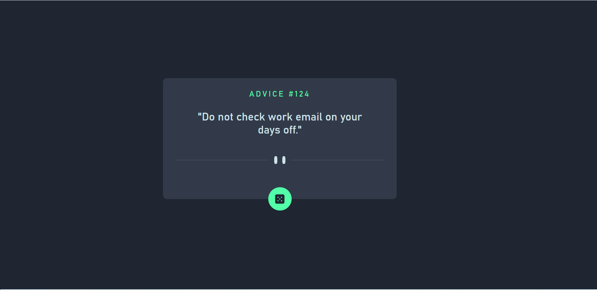
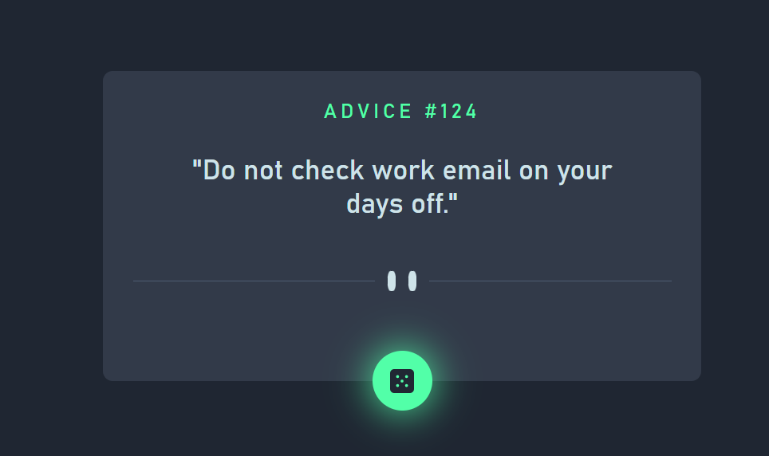

# Frontend Mentor - Advice generator app solution

This is a solution to the [Advice generator app challenge on Frontend Mentor](https://www.frontendmentor.io/challenges/advice-generator-app-QdUG-13db). Frontend Mentor challenges help you improve your coding skills by building realistic projects.

## Table of contents

- [Overview](#overview)
  - [The challenge](#the-challenge)
  - [Screenshot](#screenshot)
  - [Links](#links)
- [My process](#my-process)
  - [Built with](#built-with)
  - [What I learned](#what-i-learned)
  - [Continued development](#continued-development)
  - [Useful resources](#useful-resources)
- [Author](#author)
- [Acknowledgments](#acknowledgments)


## Overview

### The challenge

Users should be able to:

- View the optimal layout for the app depending on their device's screen size
- See hover states for all interactive elements on the page
- Generate a new piece of advice by clicking the dice icon

### Screenshot






### Links

- Solution URL: https://github.com/tarikochuery/advice-generator-app
- Live Site URL: https://advice-generator-app-psi-silk.vercel.app/

## My process

### Built with

- CSS custom properties
- Flexbox
- [React](https://reactjs.org/) - JS library
- TypeScript

### What I learned

In this project I learned how to use TypeScript with React.
Also how to fetch an external API data with a typescript function in React:

```ts
const getAdvice = async () => {
  const res = await fetch(baseURL)
  const data: dataAdvice = await res.json()
  const adviceObject: AdviceI = data.slip
  return adviceObject
}
```

### Continued development

For my next projects I look forward to work on how to make the least amount of renders with a React App.

## Author

- LinkedIn - [Tarik Chuery](https://www.linkedin.com/in/tarik-chuery/)
- Frontend Mentor - [@tarikochuery](https://www.frontendmentor.io/profile/tarikochuery)
